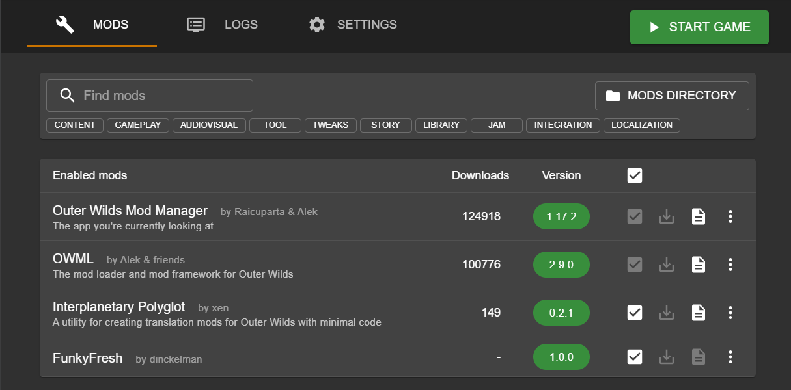

# Outer Wilds Stranger Localization Mod

Localization for the English version of Outer Wilds, and the Eye of the Universe DLC. Simply changes all references to The Stranger, and renames it to The Funky Fresh Friend.

This is a reference to a running gag in [FrogMuseum's stream](https://twitch.tv/frogmuseum)

## Installation

- Obtain OWMM from [here](https://outerwildsmods.com/mod-manager/)
- Run it, make sure the game is detected
- Download the latest release of the mod [here](https://github.com/dinckelman/outerwilds-funkyfresh-translation/releases)
- Within the OWMM Mods tab, click the Mod Directory button in the top right
- Create a folder called `dinckelman.FunkyFresh`
- Extract the contents of the archive into this folder.
- Two new mods should appear in the mod list, however make sure that all 4 mods are toggled on, as shown here

> 

## Credits

Big thanks to Xen for creating the updated [localization kit](https://github.com/xen-42/outer-wilds-localization-utility), and to andergb for the [Andalûh translation](https://github.com/andergd/OuterWildsAndaluh), which this is based on.
